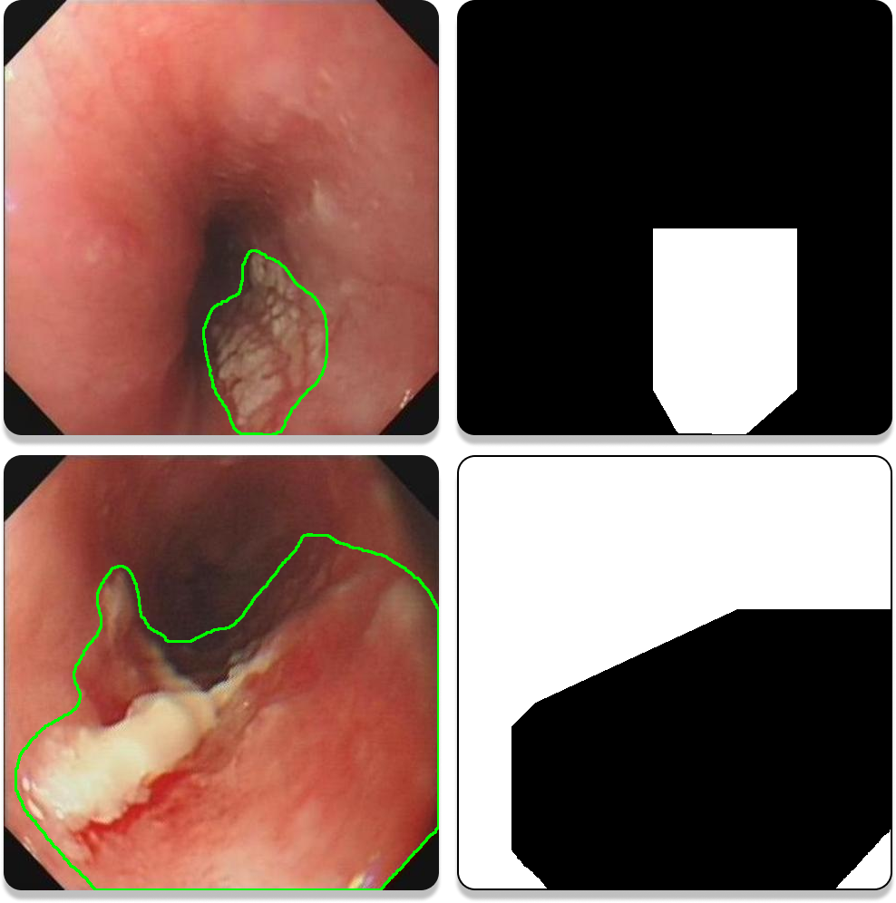

# Single-Image-Based Deep Learning for Segmentation of Early Esophageal Cancer Lesions

The test set for EEC-2022 can be found on: [EEC-2022](https://drive.google.com/file/d/1NeuGRLbicY2awAUW44uQl6BMu8S5feVy/view?usp=sharing) under the MIT License.

## 1. Preface
- Paper is available at [https://arxiv.org/abs/2306.05912](https://arxiv.org/abs/2306.05912).

## 2. Proposed Baseline

### 2.1. ROI
- To generate this ROI plot,'labelme' is used, version 3.16.7.

- Examples of ROI plots are shown in Figure 1. The white area (grey value of 255) is ROI, which is the range where the sample is located. Most of the time the sampled area is focal tissue (the first row of the examples), but for some images, where the extent of the lesion is more than 50% to 60% of the map, the normal tissue area is segmented, i.e., the ROI was chosen to be within the normal tissue area (the second row of the examples). One of the more obvious features of such images is that the four corners are white (grey value of 255). For such images, since the segmentation is the normal organisation, it is sufficient to take the complement of the final segmentation result.

<p align="center">
     <br />
    <em> 
    Figure 1. Examples of ROI plots.
    </em>
</p>

### 2.2. Sampling

- All the images you want to process can be put into `./img/`, which can facilitate subsequent operations. Record sampling information with `./interaction7_record_sample_3.0.py`. The sampling information saved are 2 files `nms`, `source` and 8 PKL files: `cent.pkl`, `cnd.pkl`, `ind.pkl`, `rnd.pkl`, `sp.pkl`, `tcnd.pkl`, `tind.pkl`, `trnum.pkl`.

## 3. Citation
```
@misc{li2023singleimagebased,
      title={Single-Image-Based Deep Learning for Segmentation of Early Esophageal Cancer Lesions}, 
      author={Haipeng Li and Dingrui Liu and Yu Zeng and Shuaicheng Liu and Tao Gan and Nini Rao and Jinlin Yang and Bing Zeng},
      year={2023},
      eprint={2306.05912},
      archivePrefix={arXiv},
      primaryClass={eess.IV}
}
```
